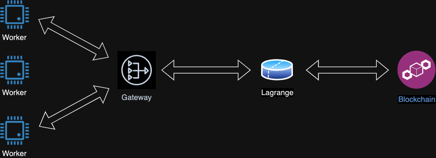

# Deploy a Worker

An AVS operator is expected to serve proving requests from Lagrange network by running a `Worker` binary. The Lagrange sequence sends through the `Gateway` tasks to workers containing all the necessary inputs to generate zkproofs. The worker continuously listens for such tasks and generate proofs accordingly.




This is a step by step guide to deploy your own worker.

### Pre-Requirements

There are **3** different types of workers. Every type can generate a specific type of proof.
You can choose your infrastrcture depending on the type of proof you would like to be able to generate.

| Worker Type | CPU | Memory | Disk | Internet |
| --- | --- | --- | --- | --- |
| `worker-sc` | 20 | 40 GB | 60GB | ✅ |
| `worker-sp` | 40 | 80 GB | 60GB | ✅ |
| `worker-sg` | 90 | 180 GB | 60GB | ✅ |

### Setup Steps

1. Install `Docker` by following this [guide](https://docs.docker.com/engine/install/)
2. Add the Ethereum keystore under `config/priv_key.json`. This is the operator keystore generated by [EigenLayer cli](https://docs.eigenlayer.xyz/eigenlayer/operator-guides/operator-installation#cli-installation).
3. Clone this repo
```sh
git clone https://github.com/Lagrange-Labs/worker.git
cd worker
```
4. Generate a Lagrange key
```sh
#Generate the key
docker compose run --rm worker avs new-key
```
You should see something like this
```sh
Input password for Lagrange key:
new Lagrange keystore stored under config/lagr_keystore.json
	public_key = "66779122cb188d1e70889278ffb3ee8ee024d4a23742a59afbdaaa096fc5135c3a14d897de87d1c56adbe029619c231416e7dfb3f1de0a542dd8ac7f4748ce07"
```
Register the Lagrange key on-chain by signing it with the AVS operator key
```sh
docker compose run --rm worker avs register
```

1. You are now registered, you can go ahead and remove the keystore from  `config/priv_key.json`

### Run the worker Steps

1. Run the worker
```sh
docker compose up -d
```